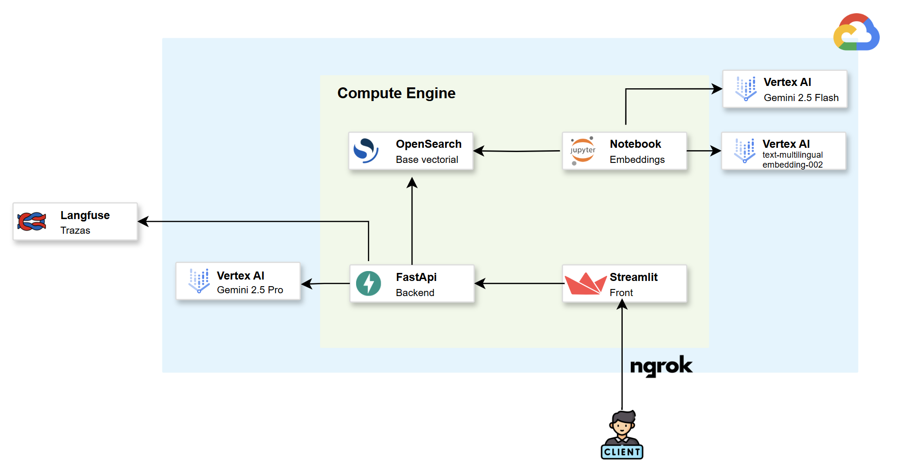
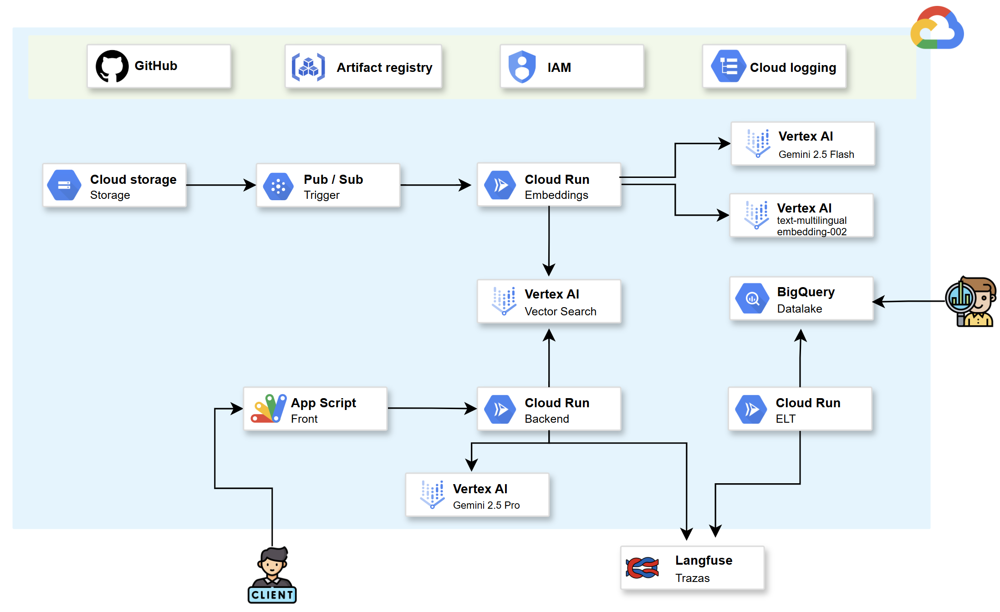

# Proyecto Tópicos avanzados en IA

Este proyecto implementa un **asistente de inteligencia artificial** cuyo propósito es facilitar a los estudiantes de la **Pontificia Universidad Javeriana** la consulta ágil y precisa del **Reglamento Estudiantil**.  

La solución se diseñó y desplegó **íntegramente en Google Cloud Platform (GCP)**, aprovechando los servicios incluidos en la capa gratuita. Para habilitar respuestas contextuales, se construyó una **base de conocimiento** donde **cada página del reglamento** se trata como un documento independiente. Esa granularidad permite aplicar la técnica de **Retrieval-Augmented Generation (RAG)**, garantizando que el asistente recupere los fragmentos relevantes del reglamento y genere respuestas fundamentadas en el texto oficial. Adicionalmente, para el desarrollo del proyecto se utilizo la siguiente arquitectura:


<div align="center">
  
</div>


| # | Componente | Descripción |
|---|------------|-------------|
| 1 | **Generación de embeddings** | 1. El PDF del Reglamento se **divide por páginas** y cada página se transforma a imagen.<br>2. Sobre cada imagen se ejecuta **Gemini 2.5 Flash (multimodal)** para extraer el texto con alta fidelidad.<br>3. El texto se normaliza y se genera la representación vectorial con el modelo **`text-multilingual-embedding-002`** de Vertex AI (768 dim).<br>4. Todo el proceso se orquesta desde un **Notebook** alojado en la misma VM y al final se produce un archivo `bulk_embeddings.json`. |
| 2 | **Base de conocimiento (OpenSearch)** | - Se despliega **OpenSearch** en un contenedor dentro de la VM.<br>- Se crea el índice `topicosindex` con soporte **KNN** y dimensión **768**.<br>- El archivo `bulk_embeddings.json` se carga vía API `_bulk`, quedando cada página del reglamento como un documento con su vector. |
| 3 | **Asistente (LangChain + LangGraph + FastAPI)** | - Implementado con **LangGraph**: dos nodos.<br>  • `search_node` → recupera los `k` documentos más relevantes desde OpenSearch.<br>  • `generate_node` → construye el mensaje de sistema y llama a **Gemini 2.5 Pro** para redactar la respuesta.<br>- Se eligió Gemini 2.5 Pro porque está en *preview* (sin coste) y ofrece mayor capacidad de razonamiento.<br>- El grafo se expone a través de un **backend FastAPI** (endpoint `POST /ask`).<br>- Todo el stack (FastAPI, OpenSearch y Dashboards) se **orquesta mediante `docker-compose.yaml`**, facilitando la puesta en marcha con un solo comando. |
| 4 | **Frontend (Streamlit + ngrok)** | - Streamlit expone una interfaz chat que:<br>  • Mantiene el historial de la conversación.<br>  • Permite reiniciar sesión.<br>- Para compartir la app públicamente sin exponer puertos se usa **ngrok**, que crea un túnel HTTPS temporal hacia la instancia de Streamlit. |
| 5 | **Observabilidad (Langfuse)** | - **Langfuse** registra cada conversación de principio a fin bajo un mismo **ID de sesión**, de forma que todas las preguntas y respuestas quedan agrupadas.<br>- En su panel se pueden ver métricas como tiempo de respuesta, uso de tokens y los pasos internos que siguió el asistente, lo que facilita el seguimiento y la mejora continua. |

> **Todo el stack corre en una única VM de Compute Engine** (entorno de desarrollo/experimentación) aprovechando la capa gratuita de Google Cloud Platform.


<div align="center">
  
</div>


# Asistente Conversacional con RAG, LangGraph y Gemini 2.5 Flash

Este proyecto implementa un asistente conversacional especializado que combina técnicas de Recuperación de Información (RAG), arquitectura modular con **LangGraph**, el modelo **Gemini Flash 2.5** de Google Vertex AI, y trazabilidad completa con **Langfuse**. Además, incluye una API desarrollada en **FastAPI** y una interfaz de conversación construida en **Streamlit**.

---

## 📁 Estructura del Proyecto

```
TOPICOS_AVANZADOS/
├── agent/                  # Componentes del grafo LangGraph
│   ├── ai_graph_state.py
│   ├── graph.py
│   ├── invoker.py
│   └── nodes.py
├── app/                    # Backend FastAPI + Dockerfile
│   ├── main.py
│   ├── Dockerfile
│   └── requirements.txt
├── prompts/                # Archivos .txt utilizados como system prompts
│   └── prompt_generate.txt
├── utils/                  # Utilidades como Vertex AI y OpenSearch config
│   └── chat_utils.py
├── notebooks/              # Scripts exploratorios y de embeddings
│   ├── embedding.ipynb
│   └── probando.ipynb
├── app.py                  # Aplicación Streamlit (interfaz de usuario)
├── docker-compose.yaml     # Orquestación de FastAPI + OpenSearch
├── bulk_embeddings.json    # Archivo auxiliar de embeddings (carga masiva)
├── base_conocimiento_colombia.xlsx
└── README.md
```

---

## 🧠 Componentes Principales

### 1. **LangGraph con Gemini 2.5 Flash**
- Flujo modular con 2 nodos:
  - `search_node`: realiza búsqueda semántica en OpenSearch usando embeddings de Vertex AI.
  - `generate_node`: genera respuestas contextualizadas usando Gemini Flash 2.5.
- El grafo se compila con `graph.py` y se ejecuta desde `invoker.py`.

### 2. **OpenSearch como fuente documental**

El asistente utiliza OpenSearch como motor de búsqueda para implementar RAG (Retrieval-Augmented Generation). Los documentos se cargan con embeddings vectoriales y se consultan mediante búsquedas semánticas (`knn_vector`). A continuación se describe el proceso completo para preparar el entorno:

#### 🧱 Requisitos previos de sistema

Antes de desplegar OpenSearch, asegúrate de aumentar el límite de memoria de mapeo:

```bash
sudo sysctl -w vm.max_map_count=262144
```

#### 🚀 Despliegue del entorno (FastAPI + OpenSearch + Dashboards)

```bash
docker-compose up -d --build
```

Este comando levanta tres servicios:
- `opensearch` en `https://localhost:9200`
- `opensearch-dashboards` en `http://localhost:5601`
- `ia-assistant` en `http://localhost:8000`

> 🔒 Asegúrate de que los nombres de host en `chat_utils.py` usen `"opensearch"` (no `localhost`) al estar en contenedor.

#### 🏗️ Creación del índice para embeddings

Una vez levantado OpenSearch, se debe crear el índice `topicosindex` con soporte para búsqueda vectorial (KNN). Ejecuta el siguiente comando:

```bash
curl -X PUT "https://localhost:9200/topicosindex" \
  -k \
  -u admin:Nagato123! \
  -H 'Content-Type: application/json' \
  -d '{
    "settings": {
      "index": {
        "knn": true,
        "number_of_shards": 1,
        "number_of_replicas": 0
      }
    },
    "mappings": {
      "properties": {
        "embedding": {
          "type": "knn_vector",
          "dimension": 768
        },
        "metadata": {
          "type": "object",
          "properties": {
            "filename": {
              "type": "keyword"
            },
            "tags": {
              "type": "keyword"
            },
            "id_documento": {
              "type": "integer"
            },
            "keyword": {
              "type": "keyword"
            },
            "title": {
              "type": "text",
              "fields": {
                "keyword": {
                  "type": "keyword",
                  "ignore_above": 256
                }
              }
            }
          }
        },
        "text": {
          "type": "text"
        }
      }
    }
  }'
```

#### 🧠 Generación del archivo con embeddings (`bulk_embeddings.json`)

1. Dirígete a la carpeta `notebooks/` del proyecto.
2. Abre y ejecuta el archivo `embedding.ipynb`.
3. El notebook toma información estructurada (por ejemplo, desde `base_conocimiento_colombia.xlsx`) y genera un archivo llamado `bulk_embeddings.json`, compatible con el formato de carga masiva de OpenSearch.

> 📝 Actualmente, este procesamiento aplica a datos tabulares. Se puede extender para formatos adicionales como `.txt`, `.pdf`, `.docx`, etc.

#### 📥 Carga masiva de documentos en OpenSearch

Una vez generado el archivo `bulk_embeddings.json`, puedes cargarlo directamente al índice creado:

```bash
curl -X POST "https://localhost:9200/topicosindex/_bulk" \
  -u admin:Nagato123! \
  -H "Content-Type: application/json" \
  --data-binary @embedding_manual.json \
  -k
```

---

### 3. **FastAPI para servir el asistente**
- Expuesto en el puerto `8000`.
- Endpoint POST `/ask` que recibe una pregunta y retorna la respuesta generada.
- Historial conversacional no se gestiona aquí (lo maneja Streamlit).

### 4. **Streamlit como interfaz de usuario**
- Título fijo: `Chatea con nuestro asesor interno`.
- Permite enviar mensajes y visualizar el historial.
- Botón `🗑️ Borrar conversación` que reinicia el historial e ID de sesión.
- Input de texto siempre en la parte inferior.
- Mensajes del usuario alineados a la derecha.
- Mensajes de la IA alineados a la izquierda.
- El historial se gestiona dentro del frontend y se mantiene por sesión.

### 5. **Langfuse para trazabilidad**
- Cada interacción con el modelo queda registrada.
- Se integró mediante `LangfuseCallbackHandler` en `invoker.py`.
- Las claves están quemadas directamente en el código por simplicidad.

---

## 🚀 Instrucciones de Uso

### 1. Posicionarte en el directorio raíz del proyecto

```bash
cd TOPICOS_AVANZADOS
```

### 2. Construir y levantar los servicios

```bash
docker-compose up --build
```

---

### 3. Ejecutar la interfaz en Streamlit

```bash
streamlit run app.py
```

---

## 🧪 Endpoint disponible

**POST /ask**

- **Input JSON:**
```json
{ "question": "¿Qué es el cambio climático?" }
```

- **Output JSON:**
```json
{ "response": "El cambio climático es..." }
```

---

## 📝 Notas finales

- Todos los prompts están cargados desde archivos `.txt` en `prompts/`, lo cual permite su modificación en tiempo real durante desarrollo.
- Las claves de Langfuse están quemadas directamente en `invoker.py`.
- La gestión del historial y la experiencia conversacional completa se maneja desde el frontend en Streamlit.

---

## 🛠️ Requisitos técnicos

- Docker y Docker Compose
- Python 3.10+
- Acceso habilitado a Vertex AI y al modelo `gemini-2.5-flash-preview-04-17`
- OpenSearch correctamente configurado localmente

---

## Exponer ngrok 

```bash
ngrok http --url=correct-bengal-whole.ngrok-free.app 8501
```

